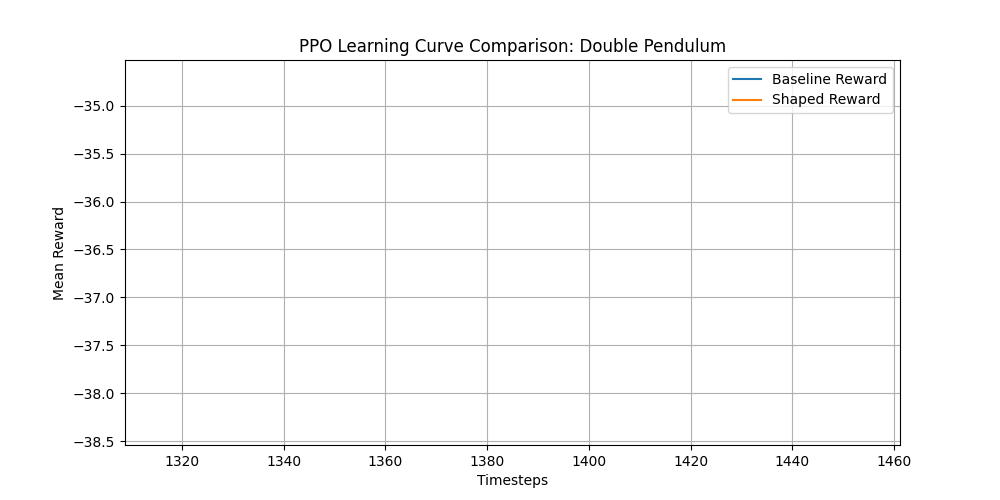
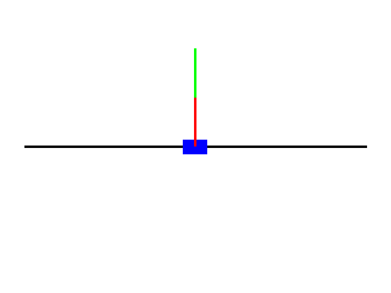
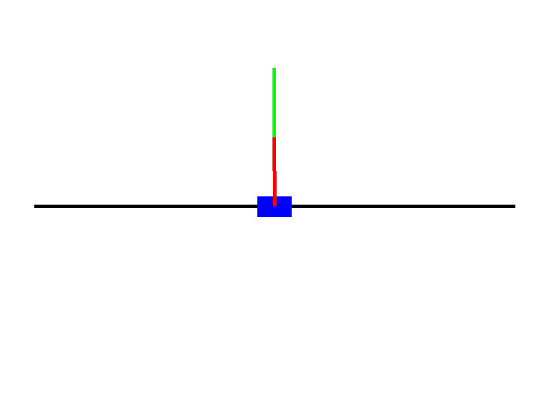

# Double Inverted Pendulum RL Agent

A reinforcement learning project that trains a PPO agent to balance a double inverted pendulum using a custom `pymunk` physics environment. Built with `gymnasium`, `stable-baselines3`, `pygame`, and `Docker`.



---

### Environment Design

The simulation is built with `pymunk` for 2D rigid-body physics:

- **Track**: A static `pymunk.Segment` constraining horizontal movement (x: 50–750 px).
- **Cart**: A 1.0 kg box (50×30 px) constrained to the track via a `GrooveJoint`.
- **Pole 1**: A 0.5 kg, 100 px segment connected to the cart with a `PivotJoint`.
- **Pole 2**: A 0.5 kg, 100 px segment connected to the tip of Pole 1 with a `PivotJoint`.
- **Physics**: Gravity at 981 px/s², fixed timestep of 1/60s with 4× sub-stepping for stability.

**Observation Space** (`Box(6,)`):
| Index | Variable | Description |
|-------|----------|-------------|
| 0 | `cart_x` | Normalized cart position (-1 to 1) |
| 1 | `cart_vx` | Normalized cart velocity |
| 2 | `theta1` | Pole 1 angle (radians, [-π, π]) |
| 3 | `omega1` | Pole 1 angular velocity |
| 4 | `theta2` | Pole 2 angle (radians, [-π, π]) |
| 5 | `omega2` | Pole 2 angular velocity |

**Action Space** (`Box(1,)`, range [-1.0, 1.0]): Scaled to ±5000 N force on the cart.

---

### Reward Function Design

**Baseline Reward** (`reward_type='baseline'`):

The simplest formulation — rewards uprightness only:

```
Reward = cos(θ₁) + cos(θ₂)
```

Maximum value of **2.0** when both poles are perfectly vertical. Minimum of **-2.0** when inverted.

**Shaped Reward** (`reward_type='shaped'`):

Augments the baseline with domain-knowledge penalties to guide faster learning:

```
Reward = cos(θ₁) + cos(θ₂)
       - 0.1  × |cart_x|           # Center penalty: stay near middle
       - 0.01 × (|ω₁| + |ω₂|)     # Velocity penalty: discourage wild swinging
       - 0.001 × action²            # Action penalty: discourage excessive force
```

| Term | Weight | Rationale |
|------|--------|-----------|
| Upright bonus | +1.0 each | Core goal — maximize vertical alignment |
| Center penalty | -0.1 | Prevents cart from drifting off-screen |
| Angular velocity penalty | -0.01 | Encourages smooth, stable balancing |
| Action penalty | -0.001 | Promotes energy-efficient control |

---

### Performance

**Early Training (< 5,000 steps):**



**Fully Trained Agent (200,000 steps):**



---

### How to Run

#### Prerequisites
- Docker and Docker Compose installed

#### 1. Build the Docker Image
```bash
docker-compose build
```

#### 2. Train with Baseline Reward
```bash
docker-compose run train python train.py --reward_type baseline --timesteps 200000 --save_path models/baseline
```

#### 3. Train with Shaped Reward
```bash
docker-compose run train python train.py --reward_type shaped --timesteps 200000 --save_path models/shaped
```

#### 4. Evaluate & Record GIF
```bash
docker-compose run evaluate python evaluate.py --model_path models/shaped.zip --gif_path media/agent_final.gif
```

#### 5. Generate Reward Comparison Plot
```bash
docker-compose run app python plot_results.py
```

#### Running Locally (without Docker)
```bash
pip install -r requirements.txt
python train.py --timesteps 200000 --reward_type shaped --save_path models/shaped
python evaluate.py --model_path models/shaped.zip --gif_path media/agent_final.gif
python plot_results.py
```

---

### Project Structure
```
├── Dockerfile              # Container definition
├── docker-compose.yml      # Service orchestration
├── requirements.txt        # Python dependencies
├── .env.example            # Environment variable template
├── environment.py          # DoublePendulumEnv (gymnasium API)
├── train.py                # PPO training script
├── evaluate.py             # Model evaluation & GIF capture
├── plot_results.py         # Learning curve plotter
├── reward_comparison.png   # Baseline vs Shaped reward plot
├── models/                 # Saved model checkpoints
├── logs/                   # Training monitor CSVs
└── media/                  # GIF recordings
    ├── agent_initial.gif
    └── agent_final.gif
```
